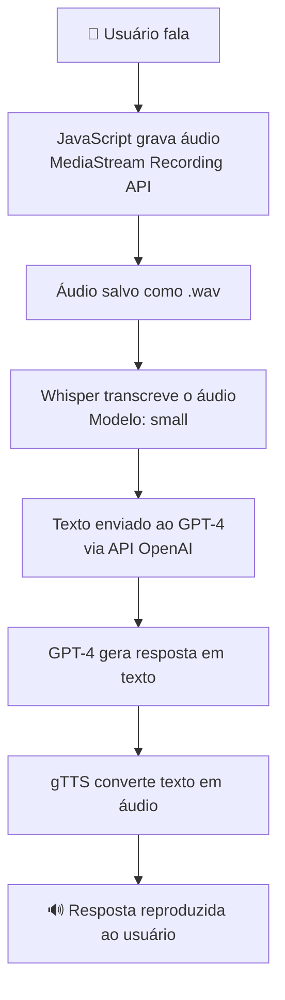

# 🎙️ Desafio de Projeto: Conversando por Voz Com o ChatGPT Utilizando Whisper (OpenAI) e Python

> **Bootcamp Bradesco · GenAI com Dados · Módulo 4 — Desafio de Projeto**

Projeto desenvolvido como parte do Bootcamp **Bradesco — Inteligência Artificial com Dados** na plataforma [DIO](https://dio.me). O desafio consiste em construir um assistente de voz inteligente, capaz de **ouvir perguntas em áudio**, **entendê-las com IA** e **responder em voz sintetizada** — tudo isso com suporte a múltiplos idiomas.

---

## 🚀 Visão Geral

O sistema integra três tecnologias poderosas em um pipeline fluido:

```
🎤 Voz do usuário
      ↓
🧠 Whisper (Speech-to-Text) — OpenAI
      ↓
💬 ChatGPT (GPT-4) — OpenAI
      ↓
🔊 gTTS (Text-to-Speech) — Google
      ↓
🎧 Resposta em áudio
```

---

## 🛠️ Tecnologias Utilizadas

| Tecnologia | Função | Link |
|---|---|---|
| **Whisper (OpenAI)** | Reconhecimento de fala (Speech-to-Text) | [github.com/openai/whisper](https://github.com/openai/whisper) |
| **GPT-4 (OpenAI)** | Processamento de linguagem natural | [platform.openai.com](https://platform.openai.com) |
| **gTTS (Google)** | Síntese de voz (Text-to-Speech) | [pypi.org/project/gTTS](https://pypi.org/project/gTTS/) |
| **Google Colab** | Ambiente de execução na nuvem | [colab.research.google.com](https://colab.research.google.com) |
| **Python 3** | Linguagem principal | [python.org](https://python.org) |

---

## 📋 Pré-requisitos

- Conta no **Google** (para usar o Google Colab)
- Chave de API da **OpenAI** ([gerar aqui](https://platform.openai.com/account/api-keys))
- Microfone disponível no navegador

---

## ⚙️ Como Executar

### 1. Abra o projeto no Google Colab

[](https://colab.research.google.com/drive/1TIPeEq71R9SsQ7OFEQFm3kEGQk8IneTb)

### 2. Configure sua API Key

No **Passo 3** do notebook, substitua `'TODO'` pela sua chave:

```python
os.environ['OPENAI_API_KEY'] = 'sua-chave-aqui'
```

### 3. Execute as células em ordem

| Etapa | Descrição |
|---|---|
| **Etapa 1** | Gravação de áudio via JavaScript no navegador |
| **Etapa 2** | Transcrição do áudio com o modelo Whisper |
| **Etapa 3** | Envio da transcrição ao ChatGPT (GPT-4) |
| **Etapa 4** | Síntese da resposta em voz com gTTS |

---

## 🌍 Suporte a Idiomas

O projeto suporta múltiplos idiomas. Para alterar o idioma de transcrição e síntese de voz, basta modificar a variável no início do notebook:

```python
language = 'pt'   # Português
# language = 'en' # Inglês
# language = 'es' # Espanhol
# language = 'fr' # Francês
```

> O Whisper foi treinado com **680.000 horas** de dados multilíngues, garantindo robustez a sotaques, ruídos de fundo e linguagem técnica.

---

## 🔄 Fluxo Detalhado



---

## 📁 Estrutura do Projeto

```
📦 voicegpt-bootcamp-bradesco/
├── 📓 dio_desafio_projeto_bootcamp_bradesco_genai_dados_modulo4.py
├── 📄 README.md
└── 📝 readme.txt
```

---

## 📚 Referências e Materiais de Apoio

- 📖 [Artigo completo do projeto na DIO](https://web.dio.me/articles/conversando-por-voz-com-o-chatgpt-utilizando-whisper-openai-e-python)
- 🔗 [Código-fonte original no Google Colab](https://colab.research.google.com/drive/1rHGq5N-sbEGtZsNUiQFT8q60BhRbj99b)
- 🎥 [Live completa no YouTube da DIO](https://www.youtube.com/watch?v=3ojLFBipm5U)
- 📦 [Modelos disponíveis do Whisper](https://github.com/openai/whisper#available-models-and-languages)
- 📘 [Documentação oficial da API OpenAI](https://platform.openai.com/docs/api-reference/introduction)

---

## 🎓 Sobre o Bootcamp

Este projeto faz parte do **Bootcamp Bradesco — Inteligência Artificial com Dados**, oferecido em parceria com a [DIO (Digital Innovation One)](https://dio.me). O bootcamp aborda conceitos de IA generativa aplicada a dados, com projetos práticos que preparam para o mercado de trabalho.

---
